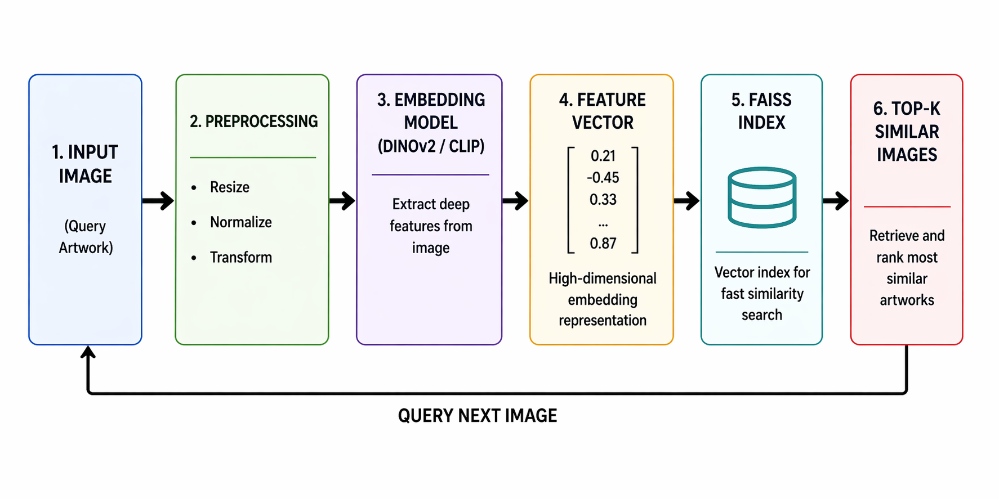
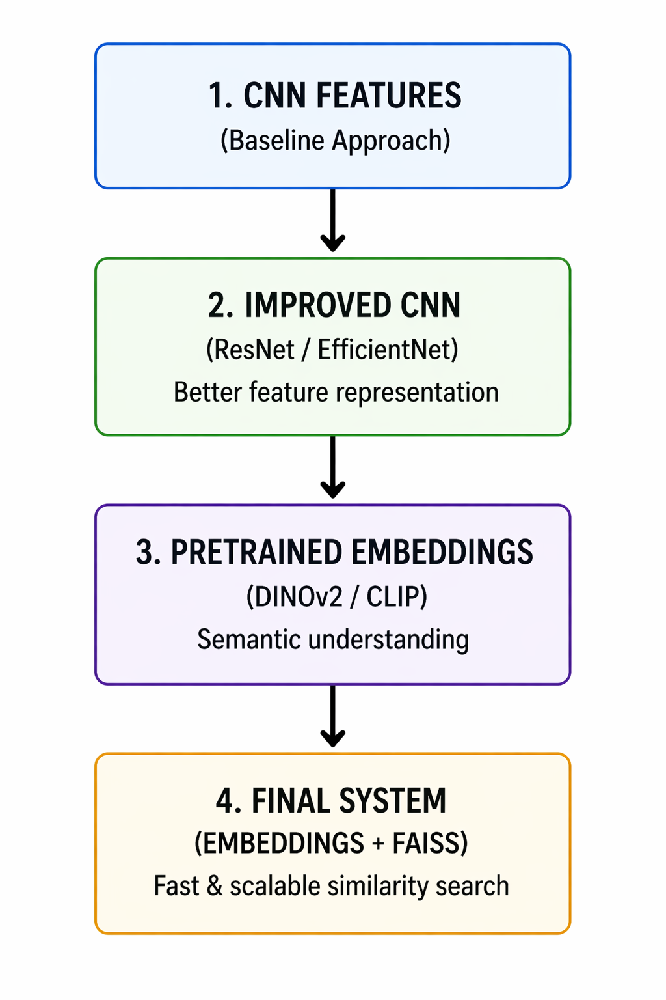
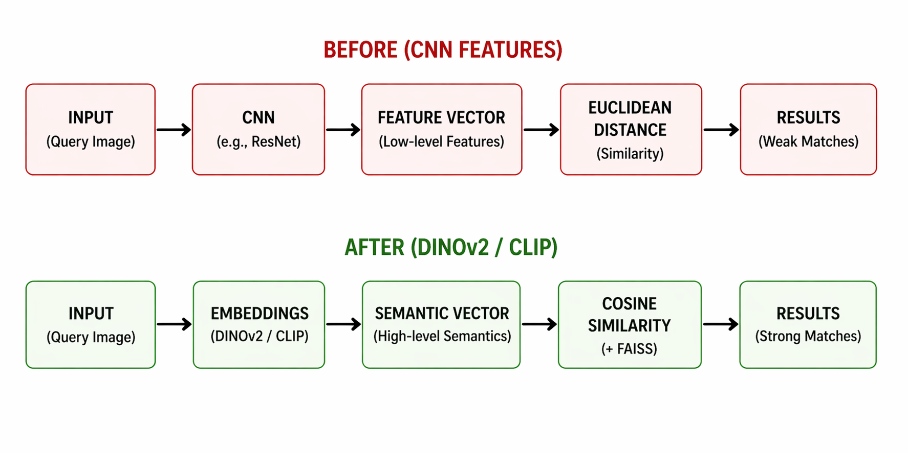
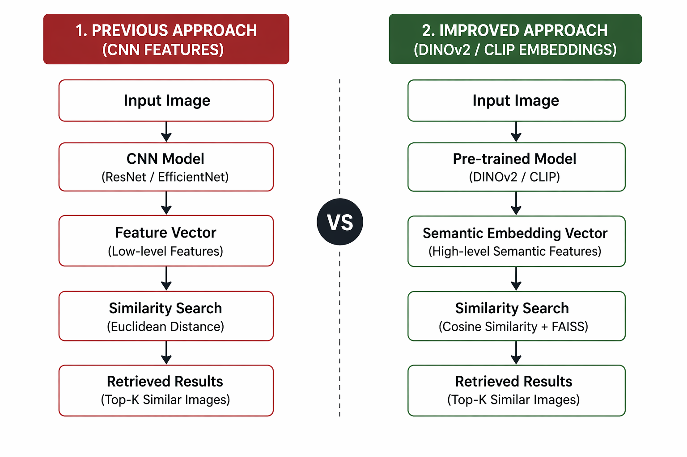
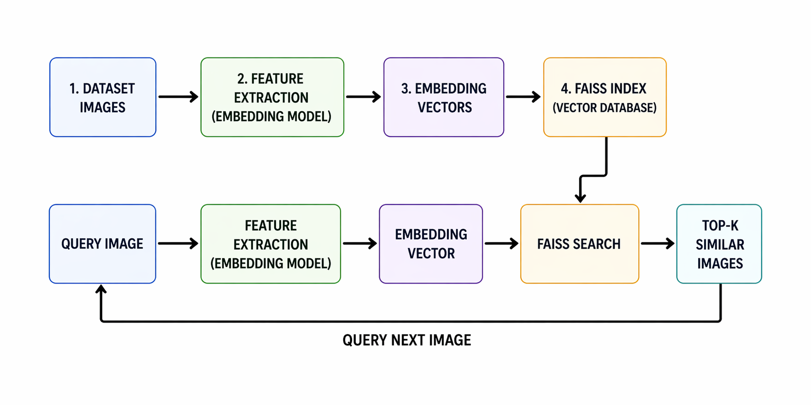
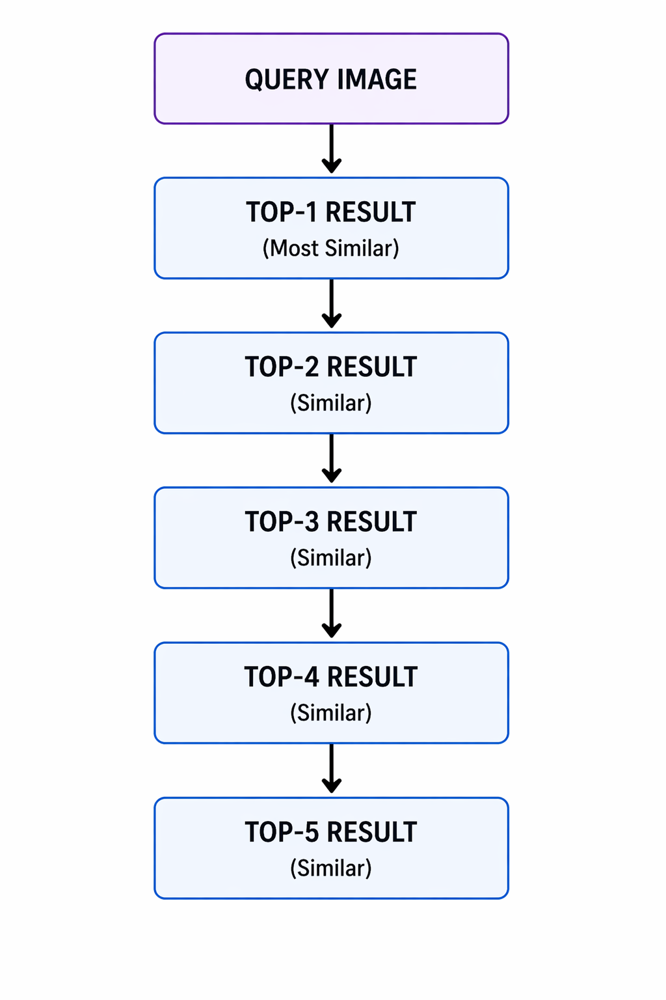

# Improvements & Evolution

---

## Performance Improvements

- Better semantic matching
- Reduced incorrect retrievals
- Improved consistency across queries

---

## Pipeline Overview

---

## Architecture Evolution

---

## Before vs After

---

## Embedding Comparison

---

## FAISS Integration

---

## Top-K Retrieval

---

## Methods Explored

### 1. CNN-based Features
- Initial baseline
- Limited semantic understanding

### 2. Fine-tuned Models
- Improved performance
- Overfitting issues

### 3. Advanced Embeddings (CLIP / DINOv2)
- Strong semantic understanding
- Best results

### 4. FAISS Indexing
- Fast retrieval
- Scalable system

---

## Final Approach

- Embedding-based similarity
- FAISS indexing
- Normalized feature space

---

## Key Takeaways

- Embeddings outperform CNN features
- FAISS improves scalability
- Combining techniques yields best results

