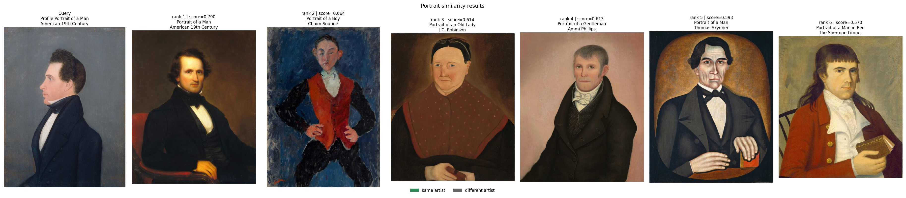
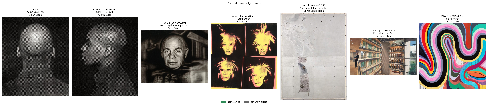
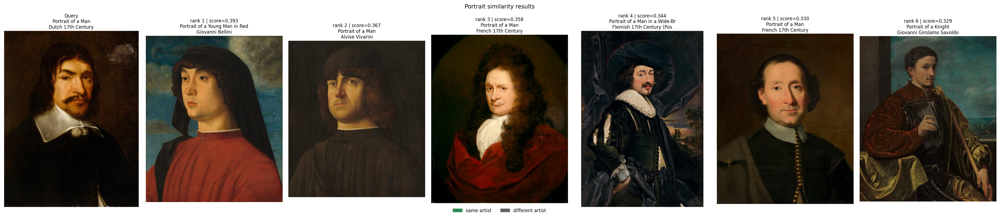

# Portrait Similarity Retrieval using Weakly Supervised Embeddings

## Overview

This project addresses **Task 2: Similarity** from the ArtExtract (HumanAI) GSoC 2025 evaluation.

The goal is to build a system that retrieves visually similar paintings — focusing on portrait similarity across face, pose, and style — using the [National Gallery of Art (NGA) open dataset](https://github.com/NationalGalleryOfArt/opendata).

The system implements an end-to-end retrieval pipeline that learns meaningful visual embeddings using weak supervision (artist metadata as proxy labels) and performs efficient similarity search using FAISS.


*Query: Profile Portrait of a Man (American 19th Century) — top 6 similar portraits retrieved by the model. Rank 1 score: 0.790.*

---

## Key Idea

The NGA dataset provides no explicit ground-truth labels for face similarity or pose. To work around this, I adopt a **weakly supervised learning** approach:

- Use **artist metadata** to construct triplets: (anchor, positive from same artist, negative from different artist)
- Fine-tune a ViT backbone with **triplet loss** to learn a compact embedding space where visually similar portraits are closer together
- Enhance retrieval with a **combined feature mode** that fuses:
  - Full-image representation (global style, composition)
  - Face-aware cues extracted via MediaPipe (localized facial structure)

This allows the model to capture both global stylistic similarity and localized portrait characteristics.

---

## Pipeline

The pipeline runs in this fixed order:

```
run_prepare.py → run_train.py → run_embed.py → run_build_index.py → run_search.py / run_evaluate.py
```

| Script | What it does |
|---|---|
| `run_prepare.py` | Downloads and filters NGA portraits by title keyword (`portrait`, `self-portrait`) |
| `run_train.py` | Fine-tunes a ViT backbone with triplet loss using artist labels as weak supervision |
| `run_embed.py` | Extracts embeddings in `full` or `combined` mode from the trained model |
| `run_build_index.py` | Wraps the embeddings in a FAISS index with optional PCA compression |
| `run_search.py` | Retrieves the top-K most similar portraits for a query image |
| `run_evaluate.py` | Computes Precision@K, mAP, and SSIM over a sampled set of queries |

---

## Setup

**Requirements:** Python 3.9+

Clone the repo and install dependencies:

```bash
git clone https://github.com/<your-username>/Art_similarity_nga.git
cd Art_similarity_nga
pip install -r requirements.txt
```

Key dependencies: `torch`, `torchvision`, `faiss-cpu`, `mediapipe`, `scikit-image`, `pandas`, `tqdm`

> **Note:** The trained model checkpoint (`.pth`) is not included due to file size. It is fully regenerated by running `run_train.py` as described below.

---

## How to Run

Follow the steps **in order**. Each step depends on the output of the previous one.

### Step 1 — Prepare Data

Downloads and filters NGA portrait paintings. Images are saved to `data/raw/images/`.

```bash
python run_prepare.py --limit 400
```

| Argument | Default | Description |
|---|---|---|
| `--limit` | None (all) | Cap on number of portraits to download |
| `--redownload` | False | Force re-download even if images already exist |

---

### Step 2 — Train the Model

Fine-tunes a ViT backbone using triplet loss. Saves the best checkpoint to `models/`.

```bash
python run_train.py --model vit --epochs 5 --lr 1e-4
```

| Argument | Default | Options |
|---|---|---|
| `--model` | `vit` | `vit`, `resnet50`, `resnet18` |
| `--epochs` | `5` | Any integer |
| `--lr` | `1e-4` | Learning rate |
| `--loss` | `triplet` | `triplet`, `hard_negative` (online mining) |

> `--loss hard_negative` skips pre-mined triplets and does online hard negative mining per batch — generally converges better.

---

### Step 3 — Generate Embeddings

Extracts embeddings from the trained model for all images in the dataset.

```bash
python run_embed.py --model vit --feature_mode combined
```

| Argument | Default | Options |
|---|---|---|
| `--model` | `vit` | `vit`, `resnet50`, `resnet18` |
| `--feature_mode` | `full` | `full`, `face`, `combined`, `pose` |

> **Recommended:** `--feature_mode combined` gives best retrieval performance (fuses full-image + face-aware features).

---

### Step 4 — Build FAISS Index

Wraps the embeddings in a FAISS index. Optional PCA compression reduces dimensionality.

```bash
python run_build_index.py --model vit --feature_mode combined --pca_dim 128
```

| Argument | Default | Description |
|---|---|---|
| `--model` | `vit` | Must match what was used in Step 3 |
| `--feature_mode` | `full` | Must match what was used in Step 3 |
| `--pca_dim` | `128` | PCA output dimension; set to `0` to skip PCA |

---

### Step 5a — Run a Search Query

Retrieves the most similar portraits for a single query image.

```bash
python run_search.py \
  --query_filename painting_100870.jpg \
  --model vit \
  --feature_mode combined \
  --pca_dim 128 \
  --top_k 6
```

| Argument | Default | Description |
|---|---|---|
| `--query_filename` | required | Filename of the query image inside `data/raw/images/` |
| `--model` | `vit` | Must match the index |
| `--feature_mode` | `full` | Must match the index |
| `--pca_dim` | `128` | Must match the index |
| `--top_k` | `6` | Number of results to retrieve |

Output visualizations are saved to `outputs/`.

---

### Step 5b — Evaluate the Full Pipeline

Runs quantitative evaluation (Precision@K, mAP, SSIM) over a sampled set of queries.

```bash
python run_evaluate.py --model vit --feature_mode combined --n_queries 50
```

| Argument | Default | Description |
|---|---|---|
| `--model` | `vit` | Must match the index |
| `--feature_mode` | `full` | Must match the index |
| `--top_k` | `10` | Retrieval depth for evaluation |
| `--n_queries` | `50` | Number of query images to evaluate over |

Results are saved to `outputs/eval_results_<model>_<feature_mode>.txt`.

---

## Results

### Quantitative Evaluation (ViT, Combined Mode, 38 queries)

| Metric | Score |
|---|---|
| Precision@1 | 0.4474 |
| Precision@5 | 0.2842 |
| Precision@10 | 0.1763 |
| mAP | **0.5423** |
| Mean SSIM (top 3) | 0.3727 |

mAP of ~0.54 is solid given the label noise from weak supervision. Precision@1 at ~0.45 is expected — artist attribution is an imperfect proxy for visual similarity, since many works are attributed to workshops rather than individual artists. The combined feature mode consistently outperforms the full-image-only mode, validating the face-aware component.

---

## Qualitative Examples

**Strong same-artist clustering (Glenn Ligon):**


*Rank 1 retrieval score: 0.817, same artist. Later ranks show cross-domain drift — an expected limitation of weak supervision.*

---

**Cross-artist retrieval with compositional similarity (Dutch 17th Century):**


*Compositionally plausible results retrieved from different artists and periods — illustrates label noise from artist-based weak supervision.*

---

## Strategy & Design Choices

**Why weakly supervised triplet loss?**
The NGA dataset has no explicit similarity labels for faces or poses. Artist metadata is the richest signal available at scale — paintings by the same artist share consistent style, palette, and sometimes subject matter. This makes artist identity a reasonable (though noisy) proxy for similarity.

**Why ViT over ResNet?**
ViT's patch-based attention mechanism captures long-range dependencies in an image, which is better suited for portrait composition (e.g., spatial relationship of face, pose, and background) compared to ResNet's local convolutional filters.

**Why combined feature mode?**
Full-image embeddings capture global style but miss fine-grained facial structure. Adding MediaPipe face landmarks as a secondary cue improves retrieval for portraits where the face is the dominant similarity signal.

**Why FAISS?**
FAISS enables sub-millisecond nearest-neighbour search even over thousands of embeddings, making the system scalable if the dataset grows.

**What didn't work:**
Cosine similarity on pretrained (non-fine-tuned) ViT features gave inconsistent results across different artists and periods — the pretrained feature space was not aligned to portrait-specific similarity. Fine-tuning with triplet loss resolved this.

---

## Evaluation Metrics

- **Precision@K** — fraction of top-K retrieved results that share the same artist as the query. Measures retrieval accuracy at different cutoffs.
- **mAP (Mean Average Precision)** — area under the precision-recall curve, averaged across all queries. Captures both precision and ranking quality.
- **SSIM (Structural Similarity Index)** — pixel-level structural similarity between query and top-3 retrieved images, resized to 128×128. Used as a complementary visual quality check independent of artist labels.

Artist identity is used as the relevance label throughout. Only artists with ≥ 3 images in the dataset are included in the evaluation to ensure meaningful precision can be computed.

---

## Limitations

- No explicit ground-truth labels for face or pose similarity — artist identity is a noisy proxy
- MediaPipe face detection fails on stylized or non-photorealistic portraits, degrading the combined mode for older works
- Dataset is relatively small (~200 portraits after filtering), which constrains both training and evaluation
- Artist attribution in the NGA dataset is often uncertain (e.g., "attributed to", "workshop of"), introducing noise in the triplet construction

---

## Project Structure

```
├── run_prepare.py          # Step 1: download and filter NGA portraits
├── run_train.py            # Step 2: fine-tune with triplet loss
├── run_embed.py            # Step 3: extract embeddings
├── run_build_index.py      # Step 4: build FAISS index
├── run_search.py           # Step 5a: query-time retrieval
├── run_evaluate.py         # Step 5b: quantitative evaluation
├── requirements.txt
├── models/                 # Saved FAISS index + PCA model
├── outputs/                # Retrieval visualizations + eval results
├── notebooks/              # similarity_demo.ipynb + PDF export
└── src/
    ├── config.py
    ├── data/
    │   ├── nga_loader.py
    │   ├── image_dataset.py
    │   └── triplet_builder.py
    ├── evaluation/
    │   └── metrics.py
    └── retrieval/
        └── retrieval_engine.py
```

---

*Developed as part of the GSoC 2025 ArtExtract evaluation (Task 2) under the HumanAI umbrella organization.*
